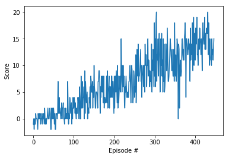

# Deep Reinforcement Learning - Project 1 Naviagtion

Author: JiaHsuan Lo

Date: 2019-0506

This report describes the first project of Udacity Deep Reinforcement Learning NanoDegree. 
The Unity ML-Agents Banana environment is used in the project. The simulation contains a 
single agent that navigates a large environment. At each time step, it has four actions at 
its disposal, including:

- 0 - walk forward 
- 1 - walk backward
- 2 - turn left
- 3 - turn right

The state space has 37 dimensions and contains the agent's velocity, along with ray-based 
perception of objects around agent's forward direction. A reward of +1 is provided for 
collecting a yellow banana, and a reward of -1 is provided for collecting a blue banana. 

The objective of this project is to implement and train a deep reinforcment learning agent
to maximize the reward.  

## Learning Algorithm

A deep Q-learning network (DQN) algorithm was used in this project. A simple fully-connected 
neuro-net architecture was applied to both the local and target networks. Experience replay 
was also used to improve the learning performance

### Q-Networks

Both the target and local networks use the same architecture, which is listed below:

- a 64-node fully-connected hidden layer
- a relu layer
- a 64-node fully-connected hidden layer
- a relu layer
- an output layer 

The soft-update scheme was used for updating the parameters of the target network. A update 
constant `tau`=0.001 was used, and the updating formula is:
```
target_net_parameter= tau * local_net_parameter + (1 - tau)*target_net_parameter
```

The episode time span was set at 300.


### Experience Replay

An experience replay buffer with a size of 1e5 was used. The sampling method is random
sampling. 

## Plot of Rewards

Here is the reward history plot:




## Future Work

The results show that a basic DQN setup with a simple two-layer fully-connected network 
architecture and a random-sampling replay buffer performs adequately to achieve the project
goal. The algorithm converges to a score of 13.00 within 523 episodes of training. 

To further improve the learning speed, several possible ideas may be helpful:

- Double DQN architecture: Using two DQN networks to determine the TD target can avoid the over-
  estimation of Q-value problem. 
- Proritized experience replay sampling: By setting the TD error as the sampling probability,
  the samples with more room of improvement are more likely to be selected. This may lead to 
  better learning efficiency.