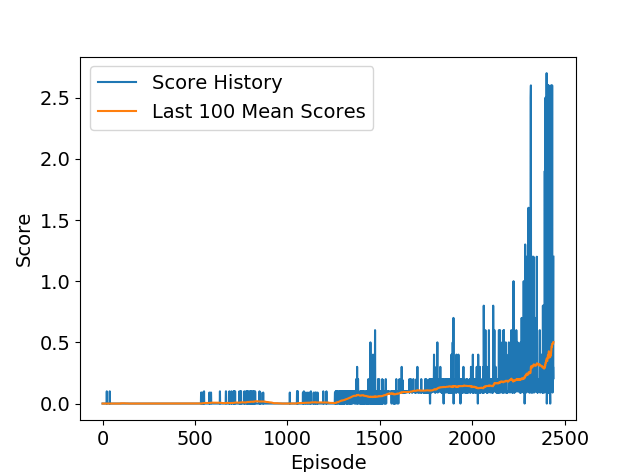

# Udacity Deep Reinforcement Learning Project 3: Collaboration and Competition

Date: 5/16/2019
Author: Josh Lo

## Introduction
This report describes the implementation of the learning algorithm used to solve a two-agent tennis game. A multiple agents **Deep Deterministic Policy Gradient** 
(MADDPG) method was used in this project. For each agent, there are a target and a local neuro-networks for each of the actor 
and critic models. The agent uses the experience replay to break the correlations between the samples during training. An Ornstein-Uhlenbeck 
process was also used to provide some randomness in the generated action. A soft updating scheme using an exponential weighted method was adopted
 to blend the target network parameters with the local network parameters gradually. The details will be listed in the following sections.

## MADDPG Agent

The MADDPG agent consists of two Deep Deterministic Policy Gradient (DDPG) agent. Each agent represents a tennis player in the environment. The DDPG agents are 
described in the following sections.

## DDPG Agent

The DDPG agent include an actor and a critic component. The actor takes the state as input and outputs the action. The output action is then fed 
into the critic network to generate the state-action Q-value. The neuro-network models of the actor and critic components are listed below:

### Actor Model

The input of each actor model is the state vector (with 24 elements) of the corresponding player, and the output is the action vector (with 2 elements) 
Local network: 2-layer of fully-connected with 96 and 96 hidden units in each layer
Target network: 2-layer of fully-connected with 96 and 96 hidden units in each layer
For each of the network, a relu layer is used after each linear layer, and a tanh function is used at the output to create a -1 to 1 action output.

### Critic Model

The centralized training concept in the MADDPG agent can be illustrated in the figure below.

The critic model uses full observations as well as full actions from both agents as the input. Therefore, the input has a dimension of 24*2 + 2*2 = 52 elements.
The output of the critic model is a scalar Q value. 
Local network: 2-layer of fully-connected with 96 and 96 hidden units in each layer
Target network: 2-layer of fully-connected with 96 and 96 hidden units in each layer
For each of the network, a relu layer is used after each linear layer. 

### Actor Model Update

The loss of the actor model is computed as:

$ actions_{pred} = actor_{local}(states) $
$ actor_{loss} = -mean(critic_{local}(states, actions_{pred}))$
The negative sign is used to maximize the Q-value.

### Critic Model Update

The loss of the critic model is computed as:

$Q_{targets}(s,a)= rewards + \gamma Q_{targets}(s_{next},a)$
$Q_{locals} = model_{critic}(s,a)$
$loss_{critic}= mean(Q_{targets} - Q_{locals})**2$
Target Model Soft Update
The target model is updated using a soft-update scheme: $\theta_{target} = \tau*\theta_{local} + (1 - \tau)*\theta_{target}$

### Noise of Action
An Ornstein-Uhlenbeck process was used to introduce noise into the action to facilitate the action. The noise parameters are:

$\mu = 0.0$
$\theta= 0.15$
$\sigma= 0.2$

### Replay Buffer
A replay buffer with random sample selection scheme was used to break the correlation between adjacent samples. The replay buffer
was pre-filled with some random samples so that the agent can start with some initial guesses. This pre-filling improves the learning 
speed in this case. The size of the replay buffer is 50000, and the pre-filling size is 20000. 

## Hyper Parameters
The hyper parameters used to train the agent are defined as a **HyperParam** class (in maddpg.py) and they are listed below:

```
class HyperParam:
    def __init__(self, state_size, action_size):
        self.state_size= state_size     # state size
        self.action_size= action_size   # action size
        self.fcsizes_actor=[96,96]      # hidden unit sizes of actor
        self.fcsizes_critic=[96,96]     # hidden unit sizes of critic
        self.lr_actor= 1e-4             # actor model learning rate
        self.lr_critic= 1e-4            # critic model learning rate
        self.discount_factor= 0.99      # discount factor
        self.tau= 1e-3                  # soft update constant
        self.seed= int(12)              # manual random seed 
        self.buffer_size= int(50000)    # replay buffer size
        self.buffer_fill= int(20000)    # random pre-fill size 
        self.batch_size= int(1024)      # batch size
        
        self.episode_count= int(5000)   # maximal number of episode
        self.max_t= int(2000)           # maximal time of each episode
        self.update_every= int(5)       # parameter update interval 
        self.score_winsize= int(100)    # window size for calculating mean score
                
        self.solve_score= 0.5           # target mean score considered as "solved"
        self.device = 'cpu'             # device used for training
```
		
## Plot of Rewards
The agent was trained to solve the problem with 2439 episodes. Here is the trainning history:

Episode 0: mean score= 0.00000000 score:-0.010000 mean score:-0.005000 last mean max score= 0.000000 
Episode 100: mean score= 0.00200000 score:-0.010000 mean score:-0.005000 last mean max score= 0.002000 
Episode 200: mean score= 0.00000000 score:-0.010000 mean score:-0.005000 last mean max score= 0.000000 
Episode 300: mean score= 0.00000000 score:-0.010000 mean score:-0.005000 last mean max score= 0.000000 
Episode 400: mean score= 0.00000000 score:-0.010000 mean score:-0.005000 last mean max score= 0.000000 
Episode 500: mean score= 0.00000000 score:-0.010000 mean score:-0.005000 last mean max score= 0.000000 
Episode 600: mean score= 0.00730000 score:-0.010000 mean score:-0.005000 last mean max score= 0.007300 
Episode 700: mean score= 0.00500000 score:-0.010000 mean score:-0.005000 last mean max score= 0.005000 
Episode 800: mean score= 0.01400000 score:-0.010000 mean score:0.045000 last mean max score= 0.014000  
Episode 900: mean score= 0.01060000 score:-0.010000 mean score:-0.005000 last mean max score= 0.010600 
Episode 1000: mean score= 0.00000000 score:-0.010000 mean score:-0.005000 last mean max score= 0.000000 
Episode 1100: mean score= 0.00670000 score:0.000000 mean score:0.045000 last mean max score= 0.006700 
Episode 1200: mean score= 0.00830000 score:-0.010000 mean score:-0.005000 last mean max score= 0.008300 
Episode 1300: mean score= 0.02650000 score:-0.010000 mean score:-0.005000 last mean max score= 0.026500 
Episode 1400: mean score= 0.06670000 score:-0.010000 mean score:0.045000 last mean max score= 0.066700  
Episode 1500: mean score= 0.05930000 score:-0.010000 mean score:-0.005000 last mean max score= 0.059300 
Episode 1600: mean score= 0.08150000 score:-0.010000 mean score:-0.005000 last mean max score= 0.081500 
Episode 1700: mean score= 0.10740000 score:0.090000 mean score:0.145000 last mean max score= 0.107400  
Episode 1800: mean score= 0.11640000 score:0.100000 mean score:0.145000 last mean max score= 0.116400   
Episode 1900: mean score= 0.14240000 score:0.100000 mean score:0.145000 last mean max score= 0.142400 
Episode 2000: mean score= 0.13630000 score:0.290000 mean score:0.295000 last mean max score= 0.136300   
Episode 2100: mean score= 0.14510000 score:0.090000 mean score:0.145000 last mean max score= 0.145100   
Episode 2200: mean score= 0.18980000 score:0.390000 mean score:0.395000 last mean max score= 0.189800  
Episode 2300: mean score= 0.23660000 score:0.190000 mean score:0.195000 last mean max score= 0.236600   
Episode 2400: mean score= 0.34440001 score:0.090000 mean score:0.095000 last mean max score= 0.344400  
Episode 2439: max score:1.200000 min score:1.190000 mean score:1.195000 last mean max score= 0.502500   
Environment solved in 2439 episodes!    Average Score: 0.502500

The resulting rewards plot is shown below:




## Ideas of Future Work
The possible direction for improving the model perfomance may include:

- Priority sampling from the replay buffer: using TD error to determine the selection priority may improve the effciency of sample usage.
- Incorporating generalized advantage estimation: adding multiple step estimation using TD($\lambda$) scheme may increase the target estimation accuracy.
- Fine tuning the hyper parameters: since the hyper parameters used to train the model is basically based on the default values from the course repository, a more systematic tuning of the parameters may improve the performance.
- Trying other deep RL framework, such as A2C, A3C, MAD4PG etc.


